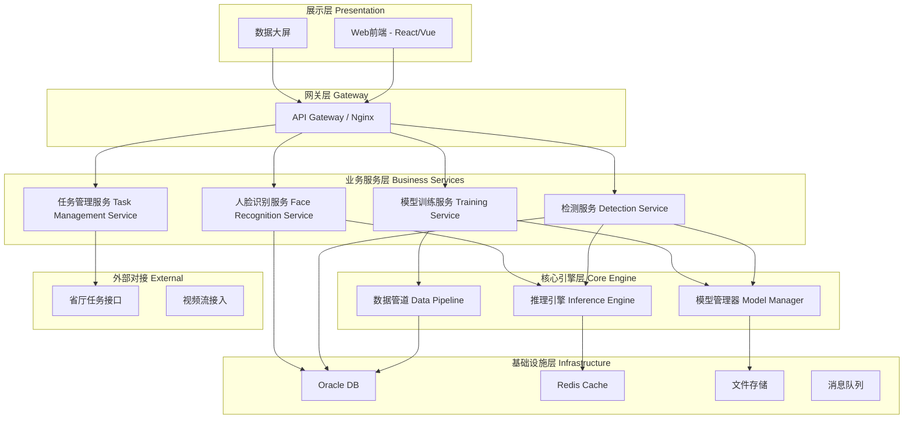
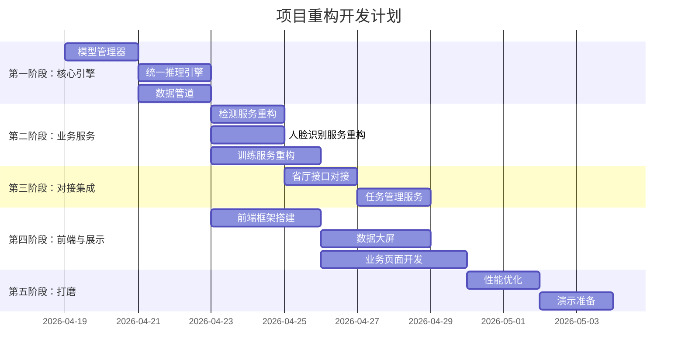

# 🏗️ 好项目的设计方法论 —— 从"道"到"器"

> [!IMPORTANT]
> 核心原则：**道 → 法 → 术 → 器**，每一层都必须在上一层确定后才展开。
> 你之前的问题就是直接从"器"（写代码）开始，跳过了"道"和"法"。

---

## 一、道（Why）—— 项目的灵魂与价值定位

**这是最高层级，决定项目的天花板。** 在比赛场景下尤为关键。

### 1.1 明确核心价值主张（一句话说清楚）

问自己：**这个项目解决了什么痛点？为什么非它不可？**

```
❌ 错误示范："我做了一个AI视频分析系统"
✅ 正确示范："基于多模型融合的智慧公安实战平台，将X类案件的线索研判效率从人工3天缩短到10分钟"
```

针对你的项目，建议提炼为：

> **"一站式AI视觉研判平台"** —— 集目标检测、人脸识别、模型自训练、任务自动下发于一体，
> 让一线民警无需AI知识，即可完成从数据采集→模型训练→实战应用的全链路闭环。

### 1.2 竞赛评分维度分析

比赛评委通常关注以下维度（按权重排序）：

| 维度 | 权重 | 你需要体现的 |
|------|------|-------------|
| **实战价值** | ⭐⭐⭐⭐⭐ | 真实案例数据、实际使用效果对比 |
| **创新性** | ⭐⭐⭐⭐ | 多模型融合、自训练、全链路闭环 |
| **技术深度** | ⭐⭐⭐ | 模型选型理由、性能优化、架构设计 |
| **可推广性** | ⭐⭐⭐ | 能否适配其他场景/其他地市 |
| **展示效果** | ⭐⭐⭐ | 演示流畅度、UI专业度、数据可视化 |

> [!TIP]
> **比赛项目和工程项目的最大区别**：比赛项目需要"讲好故事"。
> 你的"飙车炸街"专班场景就是一个绝佳的故事起点——从实战中来，到实战中去。

### 1.3 差异化定位

你的项目最大的差异化优势：

1. **全链路闭环** —— 别人可能只做检测，你从检测→识别→训练→下发全打通
2. **多模型融合** —— YOLOv8s / YOLO-World v2 / YOLOv26 多代模型可切换
3. **实战验证** —— 已经在"飙车炸街"专班实际使用过
4. **省厅对接** —— 打通了实际业务系统，不是"玩具项目"

---

## 二、法（What）—— 架构设计与模块划分

**在确定了"道"之后，才进入架构设计。这是你之前跳过的关键步骤。**

### 2.1 架构设计原则

```
核心原则：高内聚、低耦合、可扩展
```

#### 推荐架构模式：分层微内核架构



### 2.2 核心模块划分

将你现有的功能重新划分为**独立、可插拔的模块**：

| 模块 | 职责 | 边界 |
|------|------|------|
| **① 模型管理模块** | 模型注册、版本管理、模型切换（YOLO系列、InsightFace） | 不关心具体业务逻辑 |
| **② 推理引擎模块** | 统一推理接口，支持目标检测、人脸识别等多种任务 | 不关心模型从哪来 |
| **③ 数据管道模块** | 数据采集、预处理、标注管理、数据集管理 | 不关心数据用在哪 |
| **④ 训练引擎模块** | 模型训练、超参数管理、训练监控、模型评估 | 不关心训练完干什么 |
| **⑤ 业务应用模块** | 飙车炸街检测、人脸布控等具体业务场景 | 调用推理引擎，不直接操作模型 |
| **⑥ 任务管理模块** | 对接省厅接口、任务下发、结果回传 | 不关心任务内容怎么产生 |
| **⑦ 数据存储模块** | Oracle连接池、文件存储、缓存管理 | 对上层提供统一数据访问接口 |

> [!WARNING]
> **你之前的核心问题**：模块之间直接调用，没有清晰边界。
> 比如检测功能直接写了Oracle查询、文件打包逻辑，导致牵一发动全身。

### 2.3 关键架构决策

#### 决策1：统一推理接口

```python
# ❌ 之前的做法：每个模型独立调用
result = yolov8_model.predict(image)
face_result = insightface_model.get(image)

# ✅ 正确的做法：统一推理接口
class InferenceEngine:
    def predict(self, task_type: str, model_id: str, input_data) -> PredictionResult:
        """统一推理入口"""
        model = self.model_manager.get_model(model_id)
        preprocessed = self.pipeline.preprocess(input_data, task_type)
        raw_result = model.infer(preprocessed)
        return self.pipeline.postprocess(raw_result, task_type)
```

#### 决策2：业务场景可配置化

```yaml
# ❌ 之前的做法：每个场景硬编码
# if scenario == "飙车炸街":
#     model = load_yolov8("wheelie_model.pt")
#     # 一堆特定逻辑...

# ✅ 正确的做法：场景配置化
scenarios:
  - name: "飙车炸街-翘车头检测"
    model_id: "yolov8s-wheelie-v2"
    task_type: "object_detection"
    classes: ["wheelie", "normal"]
    threshold: 0.75
    post_actions: ["classify", "package", "notify"]
    
  - name: "人脸布控"
    model_id: "insightface-buffalo"
    task_type: "face_recognition"
    similarity_threshold: 0.6
    post_actions: ["alert", "record"]
```

#### 决策3：插件式模型管理

```python
# 新增模型只需注册，不需要改业务代码
model_registry.register(
    model_id="yolov26s",
    model_class=YOLOv26Detector,
    model_path="models/yolov26s.pt",
    capabilities=["object_detection"],
    metadata={"speed": "fast", "accuracy": "high"}
)
```

---

## 三、术（How）—— 技术方案与实现策略

**架构确定后，才考虑具体技术选型和实现方式。**

### 3.1 技术栈选型

| 层级 | 推荐技术 | 选型理由 |
|------|---------|---------|
| 前端 | Vue3 + Element Plus + ECharts | 公安行业Vue生态更成熟，ECharts做数据大屏 |
| 后端 | Python FastAPI（替代Flask） | 异步支持更好，自动生成API文档，性能更优 |
| AI推理 | ONNX Runtime / TensorRT | 统一推理后端，生产级性能 |
| 数据库 | Oracle（现有）+ Redis | Oracle做持久化，Redis做推理结果缓存 |
| 任务队列 | Celery + Redis | 模型训练、批量推理等耗时任务异步化 |
| 部署 | Docker + Docker Compose | 一键部署，方便演示和推广 |

> [!TIP]
> **为什么建议从Flask切换到FastAPI？**
> 1. 原生异步支持 —— 视频流处理、批量推理不阻塞
> 2. 自动生成Swagger文档 —— 评委可以直接看到API设计
> 3. Pydantic数据验证 —— 减少参数校验代码
> 4. 性能比Flask高2-3倍

### 3.2 项目目录结构（推荐）

```
smart-police-ai-platform/
├── docker-compose.yml          # 一键启动
├── README.md                   # 项目说明
├── docs/                       # 文档
│   ├── architecture.md         # 架构设计文档
│   ├── api-spec.md             # API规范
│   └── deployment.md           # 部署文档
│
├── frontend/                   # 前端
│   ├── src/
│   │   ├── views/              # 页面
│   │   │   ├── Dashboard/      # 数据大屏
│   │   │   ├── Detection/      # 检测任务
│   │   │   ├── FaceRecog/      # 人脸识别
│   │   │   ├── Training/       # 模型训练
│   │   │   └── TaskMgmt/       # 任务管理
│   │   ├── components/         # 通用组件
│   │   └── api/                # API调用封装
│   └── ...
│
├── backend/                    # 后端
│   ├── app/
│   │   ├── main.py             # 应用入口
│   │   ├── config.py           # 配置管理
│   │   ├── core/               # 核心引擎
│   │   │   ├── model_manager.py    # 模型管理
│   │   │   ├── inference_engine.py # 推理引擎
│   │   │   └── data_pipeline.py    # 数据管道
│   │   ├── services/           # 业务服务
│   │   │   ├── detection.py        # 检测服务
│   │   │   ├── face_recognition.py # 人脸识别服务
│   │   │   ├── training.py         # 训练服务
│   │   │   └── task_dispatch.py    # 任务下发服务
│   │   ├── api/                # API路由
│   │   │   ├── v1/
│   │   │   │   ├── detection.py
│   │   │   │   ├── face.py
│   │   │   │   ├── training.py
│   │   │   │   └── tasks.py
│   │   │   └── deps.py         # 依赖注入
│   │   ├── models/             # 数据模型(ORM)
│   │   ├── schemas/            # 请求/响应模型(Pydantic)
│   │   └── utils/              # 工具函数
│   ├── tests/                  # 测试
│   └── requirements.txt
│
├── ai_models/                  # AI模型相关
│   ├── configs/                # 模型配置
│   ├── weights/                # 模型权重(gitignore)
│   ├── datasets/               # 数据集管理
│   └── scripts/                # 训练/评估脚本
│
└── deploy/                     # 部署配置
    ├── nginx/
    ├── docker/
    └── scripts/
```

### 3.3 开发顺序（关键路径）



---

## 四、器（With What）—— 具体工具与实现细节

**这是最后一层，在前面三层都确定后才考虑。**

| 类别 | 工具 |
|------|------|
| AI框架 | Ultralytics YOLO、InsightFace、ONNX Runtime |
| Web框架 | FastAPI + Uvicorn |
| 前端框架 | Vue3 + Vite + Element Plus |
| 数据可视化 | ECharts / AntV |
| 数据库 | Oracle + cx_Oracle / oracledb |
| 缓存 | Redis |
| 任务队列 | Celery |
| 容器化 | Docker + Docker Compose |
| 版本控制 | Git |
| CI/CD | GitHub Actions / GitLab CI |

---

## 五、比赛加分项建议

### 5.1 数据大屏（必做）

一个酷炫的数据大屏是比赛的"门面"：
- 实时检测统计（今日检测数、告警数、模型准确率）
- 地图热力图（违规行为分布）
- 模型性能对比图（不同YOLO版本的精度/速度对比）
- 任务流转可视化

### 5.2 实战案例数据（必做）

准备2-3个真实（脱敏后的）案例：
- **案例1**："飙车炸街"翘车头检测 → 展示从图片输入到结果输出的全流程
- **案例2**：人脸布控 → 展示从任务下发到比中告警的全流程
- **案例3**：模型自训练 → 展示从标注数据到模型部署的全流程

### 5.3 性能指标量化（加分）

| 指标 | 传统方式 | 本平台 | 提升 |
|------|---------|--------|------|
| 翘车头图片筛选 | 人工8小时 | 自动10分钟 | 48倍 |
| 人脸比对 | 单张2秒 | 批量0.1秒/张 | 20倍 |
| 模型训练部署 | 需专业人员3天 | 一线民警2小时 | - |

### 5.4 答辩PPT结构建议

1. **痛点引入**（1分钟）—— 一线实战中的真实困难
2. **解决方案**（2分钟）—— 一句话说清楚你是什么
3. **技术架构**（3分钟）—— 展示专业性
4. **现场演示**（5分钟）—— 最重要！流畅演示核心功能
5. **实战成效**（2分钟）—— 数据说话
6. **推广价值**（1分钟）—— 能推广到全省/全国

---

## 六、总结：你现在应该做什么

### 立即行动清单

```
1. ⭐ 写一份1页的"项目定位文档"（道）
   - 一句话价值主张
   - 目标用户是谁
   - 解决什么核心痛点
   - 与竞品的差异化

2. ⭐ 画架构图（法）
   - 模块划分
   - 模块间的接口定义
   - 数据流向

3. 🔧 定义核心接口（术）
   - 统一推理接口
   - 模型管理接口
   - 业务服务接口

4. 🔧 按优先级开发（器）
   - 先搭核心引擎骨架
   - 再迁移现有功能
   - 最后做前端和展示
```

> [!CAUTION]
> **最大的坑：不要试图重写所有代码！**
> 你的核心逻辑（模型推理、数据库查询）是可以复用的。
> 重构的重点是**重新组织代码结构**，而不是重新实现功能。
> 建议：新建项目骨架 → 逐模块迁移 → 补充接口层 → 做前端展示
