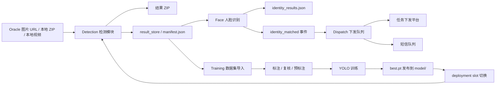

# multi-rider 项目技术与逻辑说明

## 1. 文档目的

这份文档用于会议场景下的技术说明和追问应答，内容以仓库当前代码为准，不做方案化包装，重点回答 4 个问题：

1. 这个项目到底用了哪些技术。
2. 各模块是怎么协同工作的。
3. 任务、数据和状态是怎么流转的。
4. 为什么项目会采用现在这套设计。

一句话结论：

`multi-rider` 不是单一的图片检测工具，而是一个面向内网部署的 Flask 工作台，围绕“检测结果沉淀 -> 人脸识别命中 -> 下发处置 -> 样本回流训练 -> 模型发布复用”形成闭环。

---

## 2. 项目定位与总体架构

### 2.1 项目定位

项目核心目标是服务内网场景下的智能筛查与处置联动，当前能力不是只做一次性识别，而是覆盖了：

- 数据库图片巡检
- 本地图片包/视频上传检测
- 检测结果二次做人脸识别
- 命中人员自动进入任务下发队列
- 结果样本导入数据集做标注、预标注、训练
- 新模型发布后再回到检测链路使用

### 2.2 总体运行形态

系统当前是典型的“Web 工作台 + 本地文件状态 + SQLite 状态中心 + 外部业务库接入”架构。

- `app.py` 启动 Flask 应用，注册 detection、face、dispatch、training 四类 Blueprint。
- Web 进程负责页面渲染、接口暴露、状态查询、任务发起。
- 当前主链路里的重任务默认仍以 `threading.Thread` 在进程内启动。
- 仓库同时提供了 `shared/task_queue.py` 和 `worker.py`，说明系统已经为“重任务转独立 worker 消费”准备了能力。
- 任务结果除了 ZIP 之外，还会落地为 `manifest.json`、身份识别报告、训练 manifest 等文件化中间状态，供后续模块继续消费。

启动阶段还会做几件维护动作：

- 初始化 SQLite 表结构
- 清理超过 7 天的旧检测任务及其结果文件
- 把上次异常重启时仍处于 `running` 的任务标记为 `interrupted`
- 预热默认检测模型，减少第一次推理延迟

### 2.3 架构总览



一句话结论：

项目真正的核心不是“识别一下”，而是“把识别结果变成可复用、可处置、可训练迭代的资产”。

---

## 3. 技术栈总览

### 3.1 后端与服务框架

| 类别 | 技术 | 用途 |
|---|---|---|
| Web 框架 | `Flask` | 提供工作台页面、API、会话管理 |
| HTTP 客户端 | `requests` | 下载内网图片、调用下发接口 |
| 并发 | `threading`、`concurrent.futures.ThreadPoolExecutor` | 在 Web 进程内启动重任务，数据库巡检时并发下载 |
| 本地状态存储 | `sqlite3` | jobs、datasets、train_jobs、dispatch_queue、task_queue 等状态中心 |
| Oracle 接入 | `oracledb` / `cx_Oracle` | 数据库图片 URL 查询、人员上下文查询、短信队列表写入 |
| PostgreSQL 接入 | `psycopg2-binary` | 人脸库同步 SQL 数据源 |

### 3.2 视觉检测与图像处理

| 类别 | 技术 | 用途 |
|---|---|---|
| 检测框架 | `ultralytics` | YOLO 推理与训练 |
| 深度学习 | `torch`、`torchvision` | YOLO 运行时依赖 |
| 图像基础处理 | `Pillow` | 图片解码、格式转换、结果写盘 |
| 数值处理 | `numpy` | 图像张量、向量计算 |
| 视频处理 | `opencv-python-headless` | 视频抽帧、人脸图像处理 |
| ONNX 推理 | `onnxruntime`、`onnx` | 人脸检测模型、人脸识别模型 |

### 3.3 人脸识别与向量检索

| 类别 | 技术 | 用途 |
|---|---|---|
| 人脸检测模型 | 本地 ONNX 模型 `det_10g.onnx` | 检测图片中的人脸框 |
| 人脸识别模型 | 本地 ONNX 模型 `w600k_r50.onnx` | 提取 512 维人脸特征 |
| 向量检索 | `hnswlib` 优先，`numpy` 降级 | Top-K 相似人脸检索 |

### 3.4 前端

| 类别 | 技术 | 用途 |
|---|---|---|
| 模板 | Jinja2 (`templates/`) | 工作台页面和模块分片 |
| 脚本 | 原生 JavaScript (`static/modules/`) | Tab 切换、轮询进度、数据集标注、下发交互 |
| 样式 | `tailwindcss@3.4.17` + PostCSS 预编译 CSS | 支持 Chrome 88+；页面离线引用 `static/dist/tailwind.css` |

### 3.5 部署与离线环境

| 类别 | 技术 / 资源 | 用途 |
|---|---|---|
| Windows 直跑 | Python 虚拟环境 + 本地依赖 | 开发、演示、无 Docker 场景 |
| Linux 容器化 | Docker | 长期部署 |
| Oracle 客户端 | `instantclient_11_2/` | Oracle 访问必需 |
| 离线依赖 | `wheels/`、`wheels.7z` | 内网离线安装 |
| 模型目录 | `model/` | 检测模型、CLIP、ONNX 人脸模型、训练产物 |

一句话结论：

这套技术栈的共同特点是“内网可跑、离线可装、外部依赖可降级、模型资产本地化”。

---

## 4. 目录与职责分层

### 4.1 代码目录

| 目录 | 职责 |
|---|---|
| `app.py` | Flask 入口，注册 Blueprint，初始化数据库和模型预热 |
| `worker.py` | 独立 worker 入口，消费 SQLite 任务队列 |
| `modules/detection/` | 检测模块，负责数据库巡检、本地上传、结果下载 |
| `modules/face/` | 人脸库维护、人脸识别、识别结果回填 |
| `modules/dispatch/` | 任务下发认证、队列管理、短信通知 |
| `modules/training/` | 数据集、标注、预标注、训练、模型发布与槽位切换 |
| `shared/config/` | 全局配置与环境变量解析 |
| `shared/db/` | Oracle / SQLite 访问 |
| `shared/inference/` | YOLO 模型加载和预测 |
| `shared/ownership/` | 会话隔离与任务归属判断 |
| `shared/task_queue.py` | SQLite 持久化任务队列 |
| `shared/events.py` | 进程内轻量事件总线 |

### 4.2 状态与文件目录

| 目录 / 文件 | 作用 |
|---|---|
| `jobs.sqlite3` | 全局业务状态库 |
| `output/` | 检测结果 ZIP 输出 |
| `output/_results/` | 结构化结果目录，保存 `manifest.json` 和识别素材 |
| `upload_tmp/` | 本地上传检测的临时目录 |
| `datasets/` | 训练数据集目录 |
| `train_runs/` | YOLO 训练运行目录和产物 |
| `face_data/` | 人脸照片、本地特征、人脸库缓存 |
| `model/` | 检测模型、基础模型、人脸模型、训练发布模型 |

---

## 5. 核心运行模式

### 5.1 当前主模式

当前项目实际运行时，重任务主要还是“接口发起 + 后台线程执行”模式：

- 数据库巡检检测：`modules/detection/services/job_service.py`
- 本地上传检测：`modules/detection/services/upload_job_service.py`
- 人脸库同步/重建：`modules/face/services/library_task_service.py`
- 批量预标注：`modules/training/services/auto_annotate_task_service.py`
- 训练任务：`modules/training/services/train_task_service.py`

这些任务都会把状态持续写入 SQLite，所以即使内存态丢失，历史记录仍能从库里恢复查看。

### 5.2 已预留的 worker 模式

仓库中已经存在：

- `shared/task_queue.py`：提供 `submit_task / claim_task / complete_task / fail_task`
- `worker.py`：支持消费 `train`、`auto_annotate`、`face_library` 三类任务

但从代码检索结果看，主业务流程当前尚未真正调用 `submit_task()` 入队，说明：

- 架构层面已经为独立 worker 做了准备
- 现阶段默认执行方式仍以线程直跑为主
- 后续如果要进一步提升稳定性，可以把训练、脸库、预标注逐步切到 task queue + worker

一句话结论：

项目现在是“线程执行为主，队列 worker 为扩展位”，不是纯线程，也还不是完全队列化。

---

## 6. 配置体系与环境变量

配置集中在 `shared/config/config.py`，有几个明显的设计特征：

### 6.1 配置来源

- 启动时优先加载项目根目录 `app.env`
- 其次加载 `ops/app.env`
- 环境变量可覆盖默认值
- 路径类配置统一通过 `_resolve_path()` 解析成绝对路径

### 6.2 关键配置类别

1. 数据库类

- Oracle 主库：`ORACLE_HOST / ORACLE_PORT / ORACLE_SERVICE / ORACLE_USER / ORACLE_PASSWORD`
- Oracle 短信库：`SMS_ORACLE_*`
- 人脸 SQL 源：`FACE_SQL_*`

2. 模型类

- `MODEL_PATH_BCZJ`
- `MODEL_PATH_GENERAL`
- `MODEL_DEFAULT`
- `MOBILECLIP_TS_PATH`
- `CLIP_VIT_B32_PATH`

3. 推理类

- `CONF_THRESH`
- `BATCH_SIZE`
- `IMGSZ`
- `MAX_WORKERS`
- `VIDEO_FRAME_INTERVAL`

4. 路径类

- `OUTPUT_DIR`
- `RESULTS_DIR`
- `UPLOAD_TEMP_DIR`
- `DATASETS_DIR`
- `TRAIN_RUNS_DIR`
- `SQLITE_DB_PATH`

5. 平台类

- `FLASK_SECRET_KEY`
- `APP_HOST`
- `APP_PORT`
- `YOLO_TELEMETRY`

### 6.3 内网友好设计

项目启动时会主动：

- 创建必须目录
- 默认设置 `YOLO_TELEMETRY=false`
- 在 Windows 上通过 `os.add_dll_directory()` 和 `init_oracle_client()` 准备 Oracle DLL 路径

一句话结论：

配置层的目标不是“灵活到极致”，而是“在内网机器上尽量少踩路径和联网依赖的坑”。

---

## 7. SQLite 作为全局状态中枢

SQLite 在这个项目里不是简单日志库，而是实际业务状态中心。

### 7.1 主要表

| 表名 | 用途 |
|---|---|
| `jobs` | 检测任务主表，保存数据库巡检和上传检测结果 |
| `datasets` | 数据集元信息 |
| `dataset_assets` | 数据集图片资产 |
| `train_jobs` | 训练任务 |
| `auto_annotate_jobs` | 批量预标注任务 |
| `dispatch_auth_sessions` | 下发平台登录会话 |
| `dispatch_queue` | 待下发处置队列 |
| `dispatch_records` | 正式下发历史 |
| `dispatch_sms_records` | 短信发送历史 |
| `task_queue` | 预留给独立 worker 的持久化任务队列 |

### 7.2 为什么用 SQLite

因为当前系统的大多数状态都属于：

- 单机部署
- 本地可恢复
- 读写频率中等
- 不需要额外运维数据库

这使得 SQLite 很适合作为本地工作台的状态总线。

### 7.3 SQLite 在项目中的真正作用

它负责的不是“存业务原始数据”，而是“存工作台运行态”：

- 某个检测任务做到哪一步了
- 某个数据集有哪些图片、标注到哪了
- 某个训练任务是否完成
- 某个人脸命中是否已经入队下发
- 某次短信是否已经发送

一句话结论：

Oracle / PostgreSQL 存外部业务数据源，SQLite 存本系统自己的运行状态和工作流状态。

---

## 8. 检测模块逻辑

检测模块分两条链路，但共享同一套推理服务。

### 8.1 数据库巡检检测

主入口：

- `modules/detection/job_routes.py`
- `modules/detection/services/job_service.py`
- `shared/db/oracle.py`

执行流程：

1. 前端提交时间范围、小时段、模型、阈值等参数。
2. 后端调用 `fetch_image_urls()` 到 Oracle 查询 `PIC_ABBREVIATE` 和时间字段。
3. 创建内存任务记录 `JOBS[job_id]`，同时立即持久化到 SQLite。
4. 用 `ThreadPoolExecutor` 并发下载图片。
5. 下载成功的图片按批次进入 `_predict_batch()`。
6. 命中的图片写入 ZIP，同时写入 `result_store`。
7. 最终在 `output/_results/<job_id>/` 生成结构化结果目录和 `manifest.json`。
8. 检测摘要写入 `summary_text`，状态更新为 `done / error / canceled`。

### 8.2 本地上传检测

主入口：

- `modules/detection/upload_routes.py`
- `modules/detection/services/upload_job_service.py`

支持输入：

- ZIP 图片包
- MP4 / AVI / MOV / MKV / MPG / MPEG 视频

ZIP 流程：

1. 先把上传文件保存到临时目录。
2. 统计 ZIP 中有效图片数。
3. 后台线程读取图片、做批量推理。
4. 命中结果打成 `upload_<job_id>.zip`。
5. 同步写入 `result_store` 和 `manifest.json`。

视频流程：

1. 上传视频后保存到临时目录。
2. 用 OpenCV 打开视频。
3. 按 `VIDEO_FRAME_INTERVAL` 抽帧。
4. 每批帧转换成图片对象后统一推理。
5. 命中的帧保存成 JPG 再打包到 ZIP。

### 8.3 模型选择逻辑

项目里有两类主要检测模型：

1. `general`

- 对应 `yolov8s-worldv2.pt` 或同类通用模型
- 属于开放词表检测
- 通过英文提示词控制关注目标
- 默认提示词是 `person,motorcycle,bicycle,car,bus,truck`
- 对提示词模型，预测时实际用的 `predict_conf` 会被压到不高于 `0.25`，再在结果阶段用用户阈值二次过滤，这样更利于开放词表召回

2. `bczj`

- 对应私有飙车炸街模型
- 属于闭集检测
- 支持按类别索引或类别名过滤
- 更适合专项违法行为筛查

### 8.4 结果为什么不只保留 ZIP

检测模块除了导出 ZIP，还要创建 `result_store`，其中包含：

- `assets/`：命中图片实体
- `manifest.json`：结构化清单
- 后续可再附加 `identity_results.json`

这样做的目的是让后续模块不用重新解压 ZIP，也不用重新推理，而是直接基于结构化结果继续工作。

一句话结论：

检测模块的本质是“把原始图片流转成结构化命中结果”，ZIP 只是外部交付形式，`manifest.json` 才是内部工作流的关键中间层。

---

## 9. 人脸模块逻辑

### 9.1 人脸库来源与本地化

主入口：

- `modules/face/services/library_service.py`
- `modules/face/services/identity_service.py`
- `modules/face/services/vector_store.py`

人脸库来源不是本项目自己录入，而是外部 SQL 数据源。

同步流程：

1. 通过 `psycopg2` 连接外部人脸 SQL 库。
2. 执行 `modules/face/sql/face_library.sql`，若该文件不存在或为空，则退回内置 SQL。
3. 提取人员证件信息和照片字段。
4. 把照片保存到本地 `face_data/photos/`。
5. 调 ONNX 模型提取 512 维 embedding。
6. 把 embedding 保存到 `face_data/features/*.npy`。
7. 把人员记录保存到 `person_db.pkl`。

### 9.2 staged swap 设计

人脸库同步和重建都不是直接覆盖线上文件，而是：

1. 先创建临时 stage 目录。
2. 在 stage 目录中生成照片、特征、pickle 和 meta 文件。
3. 全部成功后再统一 swap 到正式目录。
4. 最后清理旧备份和临时目录。

这样做的目的很明确：

- 避免同步一半时线上库处于半成品状态
- 保证识别过程读取到的人脸库始终是完整版本

### 9.3 单图识别逻辑

识别流程：

1. 检查人脸库是否 ready。
2. 读取待识别图片。
3. 使用人脸检测模型找出人脸。
4. 评估质量，如无脸、低质量、模糊等情况单独标记。
5. 使用识别模型提取 probe embedding。
6. 在本地向量索引中做 Top-K 检索。
7. 按 `FACE_SIMILARITY_THR` 过滤有效命中。
8. 生成每张图、每张脸的识别结果。

返回状态可能包括：

- `matched`
- `no_match`
- `no_face`
- `low_quality`
- `library_unavailable`
- `error`

### 9.4 向量检索设计

`VectorIndex` 的设计是“能用 ANN 就 ANN，不能用就退回精确检索”：

- 安装了 `hnswlib` 时，使用近似最近邻，速度更好
- 没装时自动降级到 `numpy` 点积检索

这意味着系统不会因为少一个库就完全失去识别能力，只是性能不同。

### 9.5 识别结果如何落地

识别结果不会只留在响应里，而是调用 `persist_identity_results()` 写入：

- `identity_results.json`

同时再通过 `attach_identity_to_manifest_items()` 回填到结果清单视图，供前端详情页直接使用。

一句话结论：

人脸模块的核心不是“当场识别一下”，而是把外部人脸库本地化、可缓存化、可快速检索化。

---

## 10. 下发模块逻辑

### 10.1 模块定位

下发模块负责把“识别命中”转成“待处置事项”，本质上是工作流衔接层。

### 10.2 事件驱动入队

关键设计是轻量事件总线：

- `modules/face/routes.py` 在识别完成后 `emit("identity_matched", ...)`
- `modules/dispatch/__init__.py` 中注册了 `_on_identity_matched`
- 事件处理函数调用 `ingest_identity_results()` 把命中结果写入 `dispatch_queue`

这套设计的好处是：

- face 模块不需要直接 import dispatch 业务逻辑
- 模块之间耦合度更低
- 如果以后还有别的订阅方，也可以继续挂在这个事件上

### 10.3 队列项是怎么构造的

每个命中的人脸会生成一个 queue item，核心信息包括：

- 来源任务 ID
- 来源资产 ID
- 来源任务类型和名称
- 命中的人员姓名、身份证号、手机号
- 相似度分数
- 违法类型推断
- 所属市局、分局、派出所、地址等辖区信息
- draft 下发 payload
- identity payload

系统会基于身份证号再到 Oracle 查询辖区上下文，补全：

- 地市
- 区县
- 派出所
- 地址
- 联系方式

### 10.4 去重与状态管理

`dispatch_queue` 有一个非常关键的唯一索引：

- `owner_key + source_job_id + source_asset_id + face_index + person_id_no`

这意味着同一个用户、同一个检测结果、同一张脸、同一个人，不会被重复生成多条待下发记录。

另外，短信状态会根据是否有手机号区分：

- 有手机号：`pending`
- 没手机号：`need_phone`

### 10.5 认证、预览、发送

下发模块不是识别后自动直接推送，而是分三步：

1. 登录下发平台，获取 token
2. 预览 payload，允许前端二次确认或覆盖字段
3. 正式发送，写入 `dispatch_records`

短信也是类似逻辑：

1. 预览短信内容
2. 正式发送
3. 写入 `dispatch_sms_records`

### 10.6 mock 模式

项目支持 `DISPATCH_MOCK_MODE=true`：

- 可以不真的调用外部平台
- 仍然走完整的数据拼装、入队和记录保存流程
- 非常适合内网演示和联调

一句话结论：

下发模块的价值不在“多发一个接口”，而在于把识别命中转成可审阅、可追踪、可重复发送的业务动作。

---

## 11. 训练模块逻辑

训练模块是这个项目形成闭环的关键。

### 11.1 数据集管理

数据集核心对象包括：

- `datasets`
- `dataset_assets`
- 图片文件
- YOLO 标签文件
- 标注元信息文件

数据来源有两种：

1. 从 ZIP 直接导入数据集
2. 从检测结果 `manifest.json` 选择命中图片导入数据集

这说明检测链路和训练链路是打通的，不是两套孤立系统。

### 11.2 标注与复核状态

标注采用 YOLO 文本格式，同时维护额外的 review 状态：

- `pending`
- `reviewed`
- `confirmed`

这带来的好处是：

- 系统知道“有没有标注”
- 还知道“有没有经过人工确认”
- 训练时可以选择是否只使用 `confirmed` 样本

### 11.3 预标注

预标注有两种模式：

1. 直接调用 `auto_annotate_dataset_assets()` 执行
2. 创建批量预标注任务，由后台线程处理

预标注支持：

- 选择模型
- 设定阈值和尺寸
- 对提示词模型输入 prompt classes
- 对类别做 class mapping
- 选择是否覆盖已有标注

### 11.4 训练流程

主逻辑位于 `modules/training/services/train_task_service.py`。

流程如下：

1. 校验数据集是否存在、是否有类别、是否有图片、是否有标注。
2. 校验基础模型是否存在。
3. 切分 train/val。
   - 单图时 train 和 val 都指向同一张
   - 多图时按大约 80/20 切分
   - 至少保留 1 张验证集
4. 生成 `dataset.yaml`。
5. 生成 `train_request.json`、`train_command.txt`、`NEXT_STEPS.md`。
6. 通过 `subprocess.Popen()` 真实调用 `yolo.exe detect train`。
7. 实时把日志追加到 `train.log`。
8. 训练完成后整理 `results.csv`、`results.png`、混淆矩阵、曲线图、`best.pt`、`last.pt` 等产物。
9. 写入 `train_manifest.json`，并更新 `train_jobs` 状态。

### 11.5 训练报告

训练结束后系统还会生成可展示的数据报告，内容包括：

- precision / recall / mAP50 / mAP50-95
- box loss / cls loss
- results history
- 混淆矩阵
- 曲线图
- 演示建议和发布建议

这说明训练模块不只是“跑个命令”，而是把训练过程转成可读的业务报告。

### 11.6 模型发布与槽位切换

训练完成后，可以把 `best.pt` 发布到 `model/`：

- 模型文件复制到 `model/`
- 自动生成同名 `.meta.json`
- 写入来源任务、数据集、基础模型、指标摘要等元信息

项目还维护了 deployment slot：

- `upload_default`
- `general`
- `bczj`

槽位切换和回滚信息保存在 `model/deployment_slots.json` 中。

这意味着模型管理不只是“把文件拷过去”，而是：

- 有元信息
- 有当前生效槽位
- 有切换历史
- 有回滚能力

一句话结论：

训练模块的真正价值是“让检测结果变成训练资产，让训练产物再回到线上链路可控复用”。

---

## 12. 共享基础设施与设计理由

### 12.1 统一推理服务

`shared/inference/infer_service.py` 负责：

- YOLO 模型加载与缓存
- 模型线程锁
- 批量预测
- 图片下载
- Ultralytics 兼容补丁
- CLIP / MobileCLIP 本地资源优先加载

设计理由：

- 避免每个模块重复写模型加载逻辑
- 避免模型重复加载造成内存浪费
- 在内网场景下阻止框架偷偷联网下载资源

### 12.1.1 Oracle 连接池

`shared/db/oracle.py` 没有采用“每次查询现连现断”的简单方式，而是做了延迟初始化连接池：

- Oracle 主库和短信库分别维护独立 pool
- 驱动支持时优先使用 `oracledb.create_pool()` 或 `cx_Oracle.SessionPool`
- 只有在第一次真正访问数据库时才创建连接池

这样做的好处是：

- 降低频繁建连开销
- 减少数据库巡检和人员上下文查询时的连接抖动
- 保持启动期足够轻，只有真正用到库时才初始化连接

### 12.2 结果清单作为模块解耦中间层

`result_store_service.py` 的设计意义很大：

- 检测模块写入结果素材和 `manifest.json`
- 人脸模块读取同一份 manifest
- 训练模块也能从 manifest 二次导入样本

它本质上把“识别结果”从临时内存数据变成可复用资产。

### 12.3 会话归属隔离

`shared/ownership/ownership.py` 使用：

- `session["owner_key"]`
- 请求来源 IP

来控制任务可见性。

逻辑是：

- 有 `owner_key` 时优先按 `owner_key` 隔离
- 没有 `owner_key` 的旧记录再退回按 `owner_ip`

这保证了不同访问者不会互相看到对方任务。

### 12.4 事件总线

`shared/events.py` 是一个进程内同步事件总线。

设计理由：

- 让模块之间协作，但不硬编码直接调用
- 适合当前单进程/轻量场景
- 订阅方异常只记日志，不影响主流程

### 12.5 task_queue 预埋设计

`shared/task_queue.py` 把任务队列也放进 SQLite：

- `pending`
- `running`
- `completed`
- `failed`

并支持重置 stale running task、清理旧任务。

设计理由：

- 说明系统已经意识到训练、脸库、预标注这类任务不适合长期绑定 Web 进程
- 后续迁移到独立 worker 的改造成本较低

---

## 13. 数据流与状态流总结

### 13.1 检测主链路

1. Oracle URL 或上传文件进入系统
2. 后台线程执行批量检测
3. 状态写入 `jobs`
4. 命中结果写入 ZIP + `manifest.json`
5. 前端轮询展示进度和历史

### 13.2 人脸与下发链路

1. 用户在检测结果中选择资产做人脸识别
2. 系统读取 `manifest.json`
3. 生成人脸识别结果并写 `identity_results.json`
4. 触发 `identity_matched` 事件
5. 下发模块入 `dispatch_queue`
6. 用户登录下发平台并预览
7. 正式下发和短信发送
8. 历史写入 `dispatch_records / dispatch_sms_records`

### 13.3 训练闭环链路

1. 用户从 ZIP 或检测结果导入数据集
2. 人工标注 / 复核 / 预标注
3. 创建训练任务
4. 训练产物落地到 `train_runs/`
5. 发布 `best.pt` 到 `model/`
6. 更新 slot
7. 新模型再进入检测链路

一句话结论：

项目最重要的不是某个接口，而是这三条数据流能闭环衔接。

---

## 14. 为什么项目里同时用了 SQLite、Oracle、PostgreSQL

这是会议里最容易被问到的问题。

### 14.1 各自职责

- Oracle：业务图片 URL、人员上下文、短信落表，属于外部业务系统数据源
- PostgreSQL：人脸库同步源，属于外部人像底库
- SQLite：本项目本地工作台状态中心

### 14.2 为什么不只用一个库

因为三类数据性质完全不同：

- Oracle / PostgreSQL 是“外部已有业务系统”
- SQLite 是“本系统自己的状态和流程记录”

如果把本系统状态也强绑定外部库，会让项目部署和联调更重，不适合内网工作台。

一句话答法：

不是重复造库，而是“外部业务数据继续留在原系统，本项目只把自己的工作流状态本地化管理”。

---

## 15. 为什么检测结果要落 manifest，而不是只给 ZIP

### 15.1 只给 ZIP 的问题

- 人脸识别还得重新解压
- 训练导入还得重新遍历文件
- 无法附加身份识别结果
- 无法稳定回放同一批结果的结构化信息

### 15.2 manifest 的作用

`manifest.json` 保存了：

- job 基本信息
- 结果目录
- 结果资产列表
- 每个资产的路径、大小、原始名称、分组信息

这让后续模块可以把检测结果当成“数据集”来消费，而不是当成“下载文件”来消费。

一句话答法：

ZIP 是给人下载的，manifest 是给系统继续流转的。

---

## 16. 为什么训练和脸库更适合独立 worker

### 16.1 原因

训练、脸库同步、批量预标注都有几个共同点：

- 执行时间长
- 资源占用大
- 中途失败需要可恢复
- 不适合长期绑定 Web 进程生命周期

### 16.2 当前现状

当前代码里这些任务仍主要通过线程启动，这样实现快、接入简单，但也有边界：

- 进程重启会中断在跑任务
- Web 进程和重任务抢 CPU / 内存
- 任务调度和隔离能力有限

### 16.3 为什么说项目已经为 worker 做了准备

因为已经有：

- `task_queue`
- `worker.py`
- stale running task reset
- task result / error / retry 字段

所以可以回答为：

“当前是线程直跑为主，但已经预埋了 SQLite 持久化任务队列和 worker 机制，后续可以平滑切换。”

---

## 17. `general` 与 `bczj` 两类模型的差别

### 17.1 `general`

- 通用开放词表模型
- 更适合人、车、摩托车等要素粗筛
- 通过英文 prompt 调整目标范围
- 召回更灵活，但表达依赖提示词

### 17.2 `bczj`

- 私有专项模型
- 更偏闭集场景
- 通过类别索引或类别名过滤
- 更适合固定违法行为专项筛查

### 17.3 业务层面的理解

- `general` 更像通用搜索器
- `bczj` 更像专项规则化识别器

一句话答法：

一个偏开放词表的通用粗筛，一个偏专项场景的闭集精筛。

---

## 18. 内网部署如何避免联网依赖

项目在这方面做了多层处理。

### 18.1 模型与资源本地化

- 检测模型放 `model/`
- CLIP、MobileCLIP 资源放本地文件
- 人脸 ONNX 模型放 `model/`

### 18.2 框架级补丁

`infer_service.py` 对 Ultralytics 和 CLIP 做了 offline-first patch：

- 优先查本地资源
- 找不到才走原逻辑

### 18.3 安装离线化

- `wheels/` 保存本地依赖 wheel
- `docs/OFFLINE_INSTALL_WINDOWS10.md` 提供离线安装说明
- Docker 镜像可先在联网机打包，再导入内网服务器

### 18.4 明确关闭遥测

- `YOLO_TELEMETRY=false`

一句话答法：

项目不是“要求内网能联网”，而是“从依赖、模型、框架补丁、安装方式四层都在主动去联网化”。

---

## 19. 当前边界与风险点

这部分建议会议里主动讲，显得对系统边界有清醒认识。

### 19.1 环境依赖风险

- 缺少 `cv2`、`onnxruntime`、Oracle Instant Client、人脸模型文件时，相关功能无法正常运行
- 当前本机执行 `python -m pytest` 时，测试收集阶段因缺少 `cv2` 报错，说明运行环境必须补齐图像依赖

### 19.2 线程任务风险

- 现在主链路重任务仍多为线程直跑
- 进程重启时，运行中的线程任务会中断
- `jobs` 表虽然会把 `running` 任务在重启后标为 `interrupted`，但任务不会自动续跑

### 19.3 外部系统依赖

- Oracle 主库不可用时，数据库巡检无法发起
- PostgreSQL 人脸库源不可用时，脸库同步失败
- 下发平台不可用时，正式下发只能回退到 mock 或待重试

### 19.4 单机状态中心边界

- SQLite 很适合单机内网部署
- 但如果未来要做多实例并发调度，需要重新评估状态中心和任务队列

### 19.5 模型管理边界

- 已经有模型槽位和回滚机制
- 但还不是完整的模型平台，没有审批、A/B、灰度发布这类能力

一句话结论：

项目在“内网单机闭环工作台”这个定位上是清晰且合理的，但不是面向大规模分布式调度的平台型架构。

---

## 20. 测试与验证依据

### 20.1 本文档的事实来源

本文档内容主要交叉校验自以下代码与文档：

- `README.md`
- `app.py`
- `worker.py`
- `shared/config/`
- `shared/db/`
- `shared/inference/`
- `modules/detection/`
- `modules/face/`
- `modules/dispatch/`
- `modules/training/`
- `tests/test_app_smoke.py`
- `tests/test_dispatch_and_face_services.py`
- `tests/test_shared_and_config.py`

### 20.2 当前本机验证情况

已执行：

```bash
python -m pytest
```

结果：

- 测试收集阶段报错
- 原因是当前环境缺少 `cv2`（`opencv-python-headless` 未就绪）
- 因此本文档对流程正确性的判断主要来自静态代码核查与现有 mock 测试设计，而不是当前机器上的全量动态跑通

一句话答法：

“代码逻辑和模块链路已经核对过，当前机器还差图像运行时依赖，所以测试没有完整跑通，但边界是明确的。”

---

## 21. 会议可直接口述的总括

如果会议时间很短，可以直接按下面这段话讲：

“这个项目本质上是一个内网智能研判工作台，后端用 Flask，状态中心用 SQLite，外部接 Oracle 和人脸 SQL 库，检测层基于 YOLO，脸识别层基于 ONNXRuntime，本地把人脸库做成照片加 512 维特征缓存，再通过向量检索做命中。检测结果不会只导出 ZIP，还会沉淀成 manifest，后续可以继续做人脸识别、下发入队和训练回流。下发模块通过事件总线和识别结果解耦，支持预览、正式下发和短信通知。训练模块可以把检测结果导成数据集，再做标注、预标注、YOLO 训练、best.pt 发布和模型槽位切换，所以它其实是一个从检测到处置再到模型迭代的闭环系统。当前重任务主要还是线程执行，但代码里已经预埋了 SQLite task queue 和 worker 模式，后续要往更稳的独立任务执行模式演进也有基础。”

---

## 22. 高频追问速答

### Q1：为什么要同时用 SQLite、Oracle、PostgreSQL？

答：

Oracle 和 PostgreSQL 是外部业务数据源，SQLite 是本项目自己的本地状态中心，三者职责不同，不是重复建设。

### Q2：为什么检测结果不只做成 ZIP？

答：

ZIP 是给下载的，`manifest.json` 是给系统继续做人脸识别、训练导入和历史回放的。

### Q3：为什么脸库和训练不建议一直绑在 Web 进程里？

答：

因为它们是长任务、重任务、易受进程生命周期影响，当前线程模式能跑通，但长期看更适合走持久化队列和独立 worker。

### Q4：`general` 和 `bczj` 的差异是什么？

答：

`general` 是开放词表的通用粗筛，`bczj` 是专项闭集模型，前者灵活，后者更聚焦专项场景。

### Q5：这个系统如何适配内网？

答：

依赖 wheel 本地化、模型本地化、Oracle 客户端本地化、Ultralytics/CLIP 离线补丁、关闭遥测，多层一起做去联网。

### Q6：当前最大技术风险是什么？

答：

主要是运行环境依赖和线程式长任务的边界，不是功能链路不通，而是部署环境必须准备完整，长任务后续更适合逐步切到 worker。
